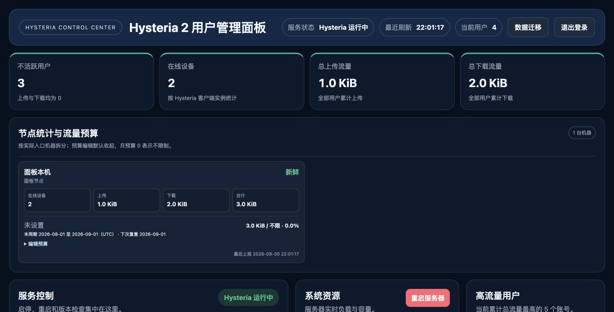
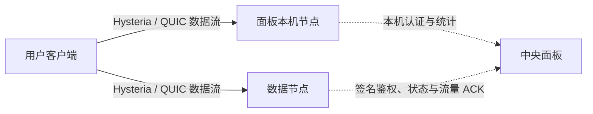

# Hysteria2-panel

[](https://github.com/Elegying/Hysteria2-panel/actions/workflows/ci.yml)
[](https://github.com/Elegying/Hysteria2-panel/releases/latest)
[](LICENSE)

一个轻量、无第三方 Python 运行时依赖的 Hysteria 2 多用户与多节点管理面板。它把账号、设备数、流量额度、节点状态、备份迁移和版本更新集中到一个网页中；用户流量直接连接目标节点，不经过管理面板中转。



## 先了解这三件事

- **适合谁**：希望自建 Hysteria 2，并通过网页管理多用户、流量限制和多台服务器的个人或小型团队。
- **它会做什么**：安装器会配置 systemd、Hysteria、面板 HTTPS、受管防火墙规则、网络参数、备份和更新服务。
- **你仍需负责什么**：准备 Linux 服务器与域名、配置 DNS 和云安全组、保管管理员及备份凭据，并遵守服务器所在地和服务商的使用规则。

如果只部署一台服务器，可以直接使用面板本机节点；需要扩容时，再从面板生成短时签名命令接入数据节点。

## 核心能力

| 能力 | 用通俗的话解释 |
|---|---|
| 一行部署 | 自动安装面板、本机 Hysteria、证书、systemd 服务和必要的网络设置 |
| 多用户管理 | 创建、禁用、改密、分享 URI/二维码，并限制客户端实例数和总流量 |
| 多节点管理 | 用短时签名命令接入节点，统一鉴权、统计和控制，不复制用户数据库 |
| 分机器统计 | 同时查看用户总流量，以及每台入口服务器各自承担的流量和设备数 |
| 安全换机 | 按“摘流 → 删除 DNS → 等待设备归零 → 停用”的流程替换服务器 |
| 双 UDP 入口 | 提供主端口和按账号授权的 UDP `443`，两者共用账号与流量额度 |
| 备份迁移 | 导出用户、流量、签名身份和 Hysteria TLS 身份，并支持 WebDAV 异地备份 |
| 可信更新 | 固定正式版本，使用 SHA-256、GitHub Actions OIDC 和 Sigstore 验证发布身份 |

## 一分钟开始

### 1. 准备服务器

部署前确认：

- 使用带 systemd 的 Linux，拥有 `root` 或 `sudo` 权限；
- 已把独立的面板域名解析到服务器公网 IP；
- 云安全组已放行 TCP `80`、面板端口，以及 Hysteria 使用的 TCP/UDP 端口；
- 面板默认使用 HTTPS。DNS 未配置正确时，安装会在申请证书前安全停止，不会自动降级为明文 HTTP。

### 2. 执行安装

在服务器上用 `root` 执行：

```bash
(umask 077;i=$(mktemp)&&trap 'rm -f "$i"' EXIT&&curl -fsSL https://raw.githubusercontent.com/Elegying/Hysteria2-panel/main/install.sh -o "$i"&&bash "$i")
```

安装器会询问节点名称、节点域名、Hysteria 端口、面板端口与协议，以及管理员账号和密码。密码不会回显。

> 这条短命令把 GitHub HTTPS 与受保护的 `main/install.sh` 作为首次信任入口，适合跟随项目当前稳定主线。安装脚本会先以 `0600` 权限保存为普通临时文件，退出时自动删除。请不要改成 `bash <(curl …)` 或 `curl … | bash`，安装器会在修改系统前拒绝这两种输入方式。

### 3. 完成首次检查

安装完成后：

1. 使用安装结果中给出的 HTTPS 地址登录；
2. 检查“服务控制”中的 Hysteria 状态；
3. 创建测试用户并复制连接 URI；
4. 用真实客户端验证主 UDP 端口；如为该用户开启 UDP `443`，再单独验证 `443`；
5. 下载一次完整备份并离线保存。

完整步骤见[安装与升级](docs/INSTALLATION.md)，常用面板操作见[使用指南](docs/USER_GUIDE.md)。

## 更严格的固定版本验签安装

生产环境可以先验证固定 Release 的发布身份、文件完整性和 shell 语法，再授予 root 权限。下面示例固定到 `v0.38.12`；安装其他版本时，请同时修改 `version`：

```bash
set -euo pipefail
version=0.38.12
workdir="$(mktemp -d)"
trap 'rm -rf -- "${workdir}"' EXIT
case "$(uname -m)" in
  x86_64|amd64)
    cosign_asset=cosign-linux-amd64
    cosign_sha256=4629c757b7618056f8ddd7e2625ae9fdd94c0372a65049520bc7d9df9efc7f71
    ;;
  aarch64|arm64)
    cosign_asset=cosign-linux-arm64
    cosign_sha256=c5d324e091826b0d7a78eb16fef316450b4eb9aaec045611c08ba06f5e73220a
    ;;
  *) echo "仅支持 Linux amd64/arm64" >&2; exit 1 ;;
esac
release_url="https://github.com/Elegying/Hysteria2-panel/releases/download/v${version}"
curl -fL --retry 3 "${release_url}/install.sh" -o "${workdir}/install.sh"
curl -fL --retry 3 "${release_url}/install.sh.sigstore.json" -o "${workdir}/install.sh.sigstore.json"
curl -fL --retry 3 \
  "https://github.com/sigstore/cosign/releases/download/v3.1.3/${cosign_asset}" \
  -o "${workdir}/cosign"
printf '%s  %s\n' "${cosign_sha256}" "${workdir}/cosign" | sha256sum --check --status
chmod 0755 "${workdir}/cosign"
"${workdir}/cosign" verify-blob "${workdir}/install.sh" \
  --bundle "${workdir}/install.sh.sigstore.json" \
  --certificate-identity \
  "https://github.com/Elegying/Hysteria2-panel/.github/workflows/release-signature.yml@refs/tags/v${version}" \
  --certificate-oidc-issuer https://token.actions.githubusercontent.com
bash -n "${workdir}/install.sh"
sudo bash "${workdir}/install.sh"
```

任一检查失败都不会以 root 执行安装器。每个正式 Release 还提供签名的 `sbom.spdx.json`，可用于核对该版本的源码文件清单。

## 工作原理



- 客户端直接连接选定节点，中央面板不转发用户数据；
- 节点在新连接认证时，向中央面板核对账号状态、流量、客户端实例数和 UDP `443` 权限；
- 各节点持续提交在线快照和可重放的流量批次，面板按用户统一汇总；
- 中央状态无法确认时，新认证会安全拒绝；面板短暂重启不会主动切断数据节点上已有的连接。

详细边界见[架构说明](docs/ARCHITECTURE.md)和[HTTP 接口契约](docs/API.md)。

## 兼容性与默认端口

部署目标需要 Python 3.8 或更高版本，以及 `apt`、`dnf` 或 `yum` 中至少一个受支持的软件包管理器。

- **定期完整 E2E**：Ubuntu 24.04 LTS、Debian stable、Rocky Linux 9，覆盖 amd64 和 arm64；
- **尽力支持**：其他 Debian/Ubuntu 版本，以及 AlmaLinux、CentOS Stream、Fedora 等兼容 systemd 与上述包管理器的发行版。生产使用前，请先在同版本 canary 服务器验证；SELinux enforcing 环境还需单独检查策略和日志。

| 用途 | 默认监听 |
|---|---|
| Hysteria 2 主入口 | 公网 UDP `19999` |
| 账号专属入口 | 公网 UDP `443`，按账号开启 |
| TCP 兼容探测 | 公网 TCP `19999` 和 `443` |
| 管理面板 | 公网 HTTPS TCP `19998` |
| Let’s Encrypt HTTP-01 | 公网 TCP `80`，仅签发或续期时使用 |
| 认证与统计接口 | `127.0.0.1` 上的 `19995`、`19996`、`19997` |

云平台安全组不受安装器控制，必须手工放行。主机使用 UFW 或 firewalld 时，安装器会先检查规则所有权，再只修改本项目需要的端口；遇到无法证明安全的自定义规则时会停止。

## 日常使用路径

- **管理用户**：创建用户 → 设置设备和流量限制 → 分享 URI 或二维码；
- **接入节点**：生成“全新节点对接”命令 → 在节点执行 → 核对 16 位指纹短码 → 等待真实数据面验收 → 手工加入 DNS；
- **替换节点**：开始摘流 → 从 DNS 删除旧 IP → 等待在线设备归零 → 检查并安全停用；
- **迁移面板**：旧服务器下载备份 → 新服务器先部署 → 上传恢复 → 验证身份与连接 → 最后切换用户域名 DNS；
- **处理故障**：先查看 `/healthz`、`/readyz`、systemd 状态和日志，不要先删除事务标记或只替换数据库。

操作细节分别见[使用指南](docs/USER_GUIDE.md)、[备份与迁移](docs/BACKUP_AND_MIGRATION.md)和[运维手册](docs/OPERATIONS.md)。

## 安全边界

- 管理面板默认使用独立域名的 Let’s Encrypt HTTPS；显式选择 HTTP 会让账号、会话和备份在网络中明文传输；
- Hysteria 使用独立的长期自签名证书，分享 URI 固定其 SHA-256 指纹；面板证书与节点证书互不替换；
- 用户认证密钥不以明文保存在数据库中；禁用、删除或改密时会请求断开旧连接；
- 网页只能调用固定的 systemd 操作，不能提交 shell、文件路径、任意版本地址或 ACL；
- `FULL` 出站允许全部公网目标，会带来扫描、垃圾邮件、BT/PT 和版权投诉风险；管理员需要自行制定用量与滥用处理规则；
- 完整备份包含恢复用户连接所需的敏感身份，等同于节点凭据，必须加密或离线保管。

发现安全问题时，请不要在公开 Issue 中披露细节，按[安全政策](SECURITY.md)提交私密报告。

## 文档导航

| 你要做什么 | 从这里开始 |
|---|---|
| 安装、重复运行安装器或在线升级 | [安装与升级](docs/INSTALLATION.md) |
| 管理用户、节点、流量与出站策略 | [使用指南](docs/USER_GUIDE.md) |
| 查看服务、健康、日志与故障恢复 | [运维手册](docs/OPERATIONS.md) |
| 备份、恢复、迁移服务器 | [备份与迁移](docs/BACKUP_AND_MIGRATION.md) |
| 理解组件、数据流与安全边界 | [架构说明](docs/ARCHITECTURE.md) |
| 对接内部 HTTP 契约 | [HTTP 接口契约](docs/API.md) |
| 发布正式版本或滚动升级多节点 | [发布与回滚](docs/DEPLOYMENT.md) |
| 查找 ADR、规格、审计与历史材料 | [完整文档索引](docs/README.md) |
| 查看版本变化 | [变更日志](CHANGELOG.md) |

## 参与项目

提交问题前，请先阅读[支持范围](SUPPORT.md)；准备代码或文档变更时，请遵循[贡献指南](CONTRIBUTING.md)。项目的合并和发布质量门禁见[稳定化与发布质量](docs/STABILIZATION.md)。

本地基础验证：

```bash
python3 -m unittest discover -s tests -v
python3 -m py_compile hysteria2_panel.py qrcodegen.py tcp_probe.py
bash -n install.sh tests/firewall_integration.sh tests/systemd_integration.sh
```

## 相关项目与许可证

- Hysteria 上游：[apernet/hysteria](https://github.com/apernet/hysteria)
- Hysteria 2 官方文档：[服务端配置](https://v2.hysteria.network/docs/advanced/Full-Server-Config/)、[流量统计 API](https://v2.hysteria.network/docs/advanced/Traffic-Stats-API/)、[URI Scheme](https://v2.hysteria.network/docs/developers/URI-Scheme/)

项目主体使用 [MIT](LICENSE)。随版本固定的 `qrcodegen.py` 来自 [Nayuki QR Code generator](https://github.com/nayuki/QR-Code-generator)，并在源码头保留其 MIT 许可证全文。
