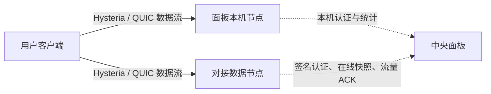

# Hysteria2-panel

[](https://github.com/Elegying/Hysteria2-panel/actions/workflows/ci.yml)
[](https://github.com/Elegying/Hysteria2-panel/releases/latest)
[](LICENSE)

轻量、无第三方 Python 运行时依赖的 Hysteria 2 多用户与多节点管理面板。它把面板本机节点和后续数据节点统一纳管：用户、设备数、流量额度和端口权限都由中央面板判定，用户数据流量则直接连接目标节点，不经过面板中转。

- 上游：[apernet/hysteria](https://github.com/apernet/hysteria)
- Hysteria 服务端配置：[官方文档](https://v2.hysteria.network/docs/advanced/Full-Server-Config/)
- 流量统计 API：[官方文档](https://v2.hysteria.network/docs/advanced/Traffic-Stats-API/)
- 连接 URI：[官方文档](https://v2.hysteria.network/docs/developers/URI-Scheme/)

## 一分钟开始

新服务器先把面板域名的 DNS A/AAAA 记录指向服务器，并在云安全组放行 TCP `80`、面板端口以及 Hysteria 所需的 TCP/UDP 端口，然后用 `root` 执行这一行：

```bash
(umask 077; installer="$(mktemp)" && trap 'rm -f -- "$installer"' EXIT && curl -fsSL https://raw.githubusercontent.com/Elegying/Hysteria2-panel/main/install.sh -o "$installer" && bash "$installer")
```

这条命令会部署管理面板和本机 Hysteria 节点，自动配置 systemd 保活、证书、主端口与账号专属 UDP `443`、`FULL` 出站策略、`fq`/内核 BBR，以及至少 16 MiB UDP 缓冲。安装完成后即可登录网页；恢复旧服务器时先上传备份，再从“对接节点”生成命令，把后续服务器接入即可。

安装器会在维护锁下从同一个普通文件重新执行，所以短命令会先以 `0600` 权限下载到临时文件，退出时自动删除。请勿改回 `bash <(curl …)` 或 `curl … | bash`；这两种写法的输入不是可重新打开的普通文件，安装器会在修改系统前明确拒绝。

> 这条短命令把 GitHub HTTPS 与受保护的 `main/install.sh` 作为首次信任入口，适合追踪项目最新稳定主线。要求更严格的生产环境，可以改用下方的固定 Release + Sigstore 验签流程，在授予 root 权限前先验证发布身份和文件完整性。

推荐顺序：

1. 配好面板 DNS 和云安全组；默认 HTTPS 首次签发要求公网 TCP `80` 可达；
2. 在面板服务器运行上面的一行命令，完成面板和本机节点部署；
3. 如果是迁移服务器，先在网页上传备份，恢复用户、流量、节点身份和 Hysteria 证书；
4. 在网页选择“全新节点对接”或“安全重绑定”，把生成的命令复制到数据节点执行；
5. 核对双方显示的 16 位指纹短码，按页面提示添加节点 DNS，等待自动验收完成。

DNS 未提前配置好时，默认 HTTPS 安装会在申请证书前安全停止，不会自动退回明文 HTTP。主机防火墙可由安装器处理，但云厂商安全组不受服务器脚本控制，必须手工放行。

## 工作原理



- 用户直接连接所选的面板本机节点或对接节点，不需要先连接面板再跳转；
- 节点在认证时向中央面板确认账号状态、流量额度、设备数和 UDP `443` 权限；
- 各节点持续上报在线快照和流量，面板按用户统一汇总，避免跨节点重复放行；
- 中央状态过期或无法确认时，新认证会安全拒绝；数据节点上的已有连接不会因为面板短暂重启被主动切断。

## 核心功能

| 能力 | 说明 |
|---|---|
| 一行部署 | 自动部署面板、本机 Hysteria、systemd 服务、证书、防火墙检查和网络优化 |
| 多用户管理 | 创建、禁用、轮换凭据、分享 URI/二维码，并设置流量和设备限制 |
| 多节点对接 | 网页生成短时签名命令，支持全新接入和保留私钥、证书、流量 spool 的安全重绑定 |
| 统一鉴权与分机器统计 | 面板本机和数据节点共用用户、设备数、流量额度及 UDP `443` 权限，并按实际入口机器拆分设备与流量 |
| 节点预算与安全换机 | 面板本机和每个数据节点独立设置月预算、告警、当前已用流量和每月重置日；按 DNS、设备归零和流量 ACK 门禁一键摘流、停用、恢复或归档 |
| 双入口与 FULL | 主 UDP 端口和账号专属 UDP `443`，节点默认自动部署 `FULL` 公网出站策略 |
| 网络优化 | Hysteria `standard` + `bbr`，以及事务化的内核 `bbr/fq` 和至少 16 MiB UDP 缓冲 |
| 备份迁移 | 一键导出/恢复用户、流量、签名身份和 Hysteria TLS 身份；可每日上传 HTTPS WebDAV 并精确保留 30 天 |
| 健康与恢复 | systemd 保活、面板 watchdog、健康/就绪探针，以及安装、恢复和升级事务回滚 |
| 可信发布 | 固定 Release、SHA-256 与 GitHub Actions OIDC/Sigstore 签名验证 |

## 安装要求与严格验签

部署目标需要 systemd、root 权限、Python 3.8 或更高版本，以及 `apt`、`dnf` 或 `yum` 中至少一个受支持的软件包管理器。当前兼容性按自动化证据分层：

- **定期完整 E2E**：Ubuntu 24.04 LTS、Debian stable 与 Rocky Linux 9 的 amd64/arm64；nightly 会在干净的 systemd 容器中执行完整安装、升级和异常中断恢复；
- **尽力支持**：其他 Debian/Ubuntu 版本，以及 AlmaLinux、CentOS Stream、Fedora 等兼容 `apt`/`dnf`/`yum` 的 systemd 发行版。它们共享安装器路径但没有逐版本、逐架构的完整 E2E 证明，生产部署前必须先在同版本 canary 验证；SELinux enforcing 主机还需单独验证策略和日志。

<details>
<summary>展开：固定正式版本并使用 Sigstore 验签安装</summary>

以下流程会在执行 root 安装器前，验证固定 Release 的发布身份、文件完整性和 shell 语法：

```bash
set -euo pipefail
version=0.33.2
workdir="$(mktemp -d)"
trap 'rm -rf -- "${workdir}"' EXIT
case "$(uname -m)" in
  x86_64|amd64)
    cosign_asset=cosign-linux-amd64
    cosign_sha256=4629c757b7618056f8ddd7e2625ae9fdd94c0372a65049520bc7d9df9efc7f71
    ;;
  aarch64|arm64)
    cosign_asset=cosign-linux-arm64
    cosign_sha256=c5d324e091826b0d7a78eb16fef316450b4eb9aaec045611c08ba06f5e73220a
    ;;
  *) echo "仅支持 Linux amd64/arm64" >&2; exit 1 ;;
esac
release_url="https://github.com/Elegying/Hysteria2-panel/releases/download/v${version}"
curl -fL --retry 3 "${release_url}/install.sh" -o "${workdir}/install.sh"
curl -fL --retry 3 "${release_url}/install.sh.sigstore.json" -o "${workdir}/install.sh.sigstore.json"
curl -fL --retry 3 \
  "https://github.com/sigstore/cosign/releases/download/v3.1.3/${cosign_asset}" \
  -o "${workdir}/cosign"
printf '%s  %s\n' "${cosign_sha256}" "${workdir}/cosign" | sha256sum --check --status
chmod 0755 "${workdir}/cosign"
"${workdir}/cosign" verify-blob "${workdir}/install.sh" \
  --bundle "${workdir}/install.sh.sigstore.json" \
  --certificate-identity \
  "https://github.com/Elegying/Hysteria2-panel/.github/workflows/release-signature.yml@refs/tags/v${version}" \
  --certificate-oidc-issuer https://token.actions.githubusercontent.com
bash -n "${workdir}/install.sh"
sudo bash "${workdir}/install.sh"
```

这段引导只执行固定正式版本的 Release 资产：先用固定 SHA-256 校验 Cosign，再验证安装器的 GitHub Actions OIDC/Sigstore 身份和 shell 语法，任一校验失败都不会以 root 执行。升级到新版本时请先把 `version` 改成对应的正式标签。

</details>

安装程序会询问分享节点名称、节点域名、Hysteria UDP 端口、面板端口与协议、管理员账号和密码。全新安装时面板协议默认是 `https`，并要求填写独立的面板公网域名，例如 `panel.example.com`；只有显式选择 `http` 时才启用明文管理面。出站策略默认是 `full`。密码输入不回显，也不会写入仓库或配置文件。也可以使用 `NODE_NAME`、`PUBLIC_HOST`、`HYSTERIA_PORT`、`PANEL_PORT`、`PANEL_SCHEME`、`PANEL_PUBLIC_HOST`、`EGRESS_POLICY`、`ADMIN_USER` 和 `ADMIN_PASSWORD` 环境变量执行无人值守部署。

重复运行安装器会先检查备份分区余量，再暂停面板写入而保持旧 Hysteria 统计端点运行，结算流量并截断 SQLite WAL 后建立带 SHA-256 清单的一致性备份；备份与开机恢复事务持久化后才允许覆盖程序。升级进程被强制终止或主机中途重启时，systemd 会在面板启动前核验清单并恢复旧版本，校验不通过则保持事务标记并拒绝覆盖。最终切换前会在认证入口已停止时，于有界窗口内持续为在线身份设置 Hysteria 断开标记，再执行最后一次流量结算并停止旧 Hysteria。`/kick` 只在客户端下一次产生流量时生效，因此完全空闲的会话可能仍显示在 `/online`，并由服务停止统一关闭；统计查询或踢线失败仍会安全回滚。恢复、手工安装、在线更新和 ACME 续期共用维护锁，不允许两项维护交叉写入。随后自动沿用现有节点名、域名、全部端口、面板协议、出站策略、HMAC 签名密钥、统计密钥、管理员和 Hysteria TLS 身份。Hysteria 的 `server.crt`、`server.key`、用户 URI 和固定指纹不会被 ACME 读取或替换；面板 HTTPS 使用另一套 Let’s Encrypt 证书。只有显式传入新值时才修改对应参数；需要重置管理员时设置 `RESET_ADMIN=1`。升级任一步或最终健康检查失败时，安装器会自动恢复旧程序、配置、证书/私钥、systemd 单元、sudoers 和网络参数；数据库优先保留升级窗口内通过完整性校验的最新状态，仅在损坏时清除 WAL/SHM 后恢复升级前快照。只有全部服务和端口通过检查后才解除回滚保护。自动备份仅清理符合安装器时间戳命名的目录，最多保留 10 份且最长 90 天，手工或恢复备份不会被匹配。这样普通升级不会令已经分享的节点失效，也不会留下半完成部署。

面板发现新正式版本后会显示“立即更新”。点击后页面会显示排队、运行、成功或失败状态，并在面板进程因升级重启期间自动重试状态查询；只有固定更新任务已经成功结束且新进程的当前版本达到目标版本才会显示成功，不再把 systemd 任务已启动或新进程刚启动误报成升级完成。该操作只允许已登录管理员携带 CSRF token 启动固定的 `hysteria2-panel-update.service`，浏览器不能传入版本、下载地址或命令。root 更新任务读取并严格校验面板排队时固定的 `vX.Y.Z` 目标，不会因执行期间出现更新版本而改变实际安装版本；随后从该版本路径下载安装器，核对安装器内版本、Sigstore 身份、解释器头和 shell 语法，再以专用非交互模式升级。在线升级强制沿用当前节点与面板参数并保留管理员、数据库、HMAC、统计密钥、TLS 证书和私钥；全新服务器不能使用该内部模式。

默认端口：

| 用途 | 监听地址 | 默认端口 |
|---|---|---:|
| Hysteria 2 | 公网 UDP | `19999` |
| 账号专属 Hysteria 入口 | 公网 UDP | `443`（按账号开启） |
| TCP 连通性兼容探测 | 公网 TCP | `19999` 和 `443` |
| 管理面板 | 公网 HTTPS TCP（可显式选择 HTTP） | `19998` |
| ACME HTTP-01 校验 | 公网 TCP（仅签发/续期时临时监听） | `80` |
| 流量统计 API | `127.0.0.1` | `19997` |
| UDP 443 入口流量统计 API | `127.0.0.1` | `19995` |
| Hysteria 认证回调 | `127.0.0.1` | `19996` |

服务器使用带 IP/域名 SAN 的 10 年自签名证书保护 Hysteria 连接。面板生成的 Hysteria URI 同时包含 `insecure=1` 和证书 SHA-256 固定指纹。面板使用 HTTP 并不影响 Hysteria 数据通道的 TLS 和证书固定。

全新安装默认使用 HTTPS；显式选择 HTTP 时仍不会设置 Secure Cookie 或 HSTS，管理员密码、会话以及备份上传下载内容都会在网络中明文传输。安装器从系统软件源安装 Certbot（RHEL/Rocky/Alma/CentOS 在当前仓库缺包时通过包管理器启用 EPEL），使用 standalone HTTP-01 为 `PANEL_PUBLIC_HOST` 申请 Let’s Encrypt 证书，并启用 `hysteria2-panel-cert-renew.timer` 每天检查两次。首次签发前会先解析面板域名，并拒绝没有公网 A/AAAA 结果的域名；首次签发和后续续期都要求该域名解析到当前服务器，公网 TCP `80` 持续可达且不能被其他本机服务占用。DNS 未配置好时安装器会在调用 Certbot 前停止，不会自动降级到 HTTP；因此“完全空白且没有预先 DNS”的服务器不能一次完成公网 HTTPS 部署。续期成功后只重启面板服务，不重启 Hysteria；失败时保留旧面板证书并写入 journal。升级会原样保留现有面板协议，不会把历史 HTTP 安装静默迁移到 HTTPS，也不会触碰 Hysteria 客户端 URI、证书或固定指纹。

面板证书采用版本目录加单一 `panel-tls-current` 链接切换，证书和私钥先完成域名及公钥配对校验再一起生效。`/etc/hysteria2-panel/panel.crt` 与 `panel.key` 只用于面板；Hysteria 永远继续使用独立的 `server.crt` 与 `server.key`。从旧版本的自签名 HTTPS 升级时必须人工运行一次安装器补填 `PANEL_PUBLIC_HOST`；在线自动更新会安全拒绝缺少该字段的旧 HTTPS 配置，避免静默继续复用节点证书。

部分网络设备会检查明文 HTTP 的 `Host` 并主动重置特定域名连接。安装器在节点域名与本机检测 IP 不同时会同时打印备用面板地址；确认该 IP 可从公网路由后，可用 `http://服务器IP:面板端口/` 登录，不需要修改 Hysteria 节点域名、证书或已分享 URI。面板会安静处理这类预期断连，避免服务日志被无意义的异常栈淹没。

> 安装器会先识别防火墙所有权：UFW 或 firewalld 中恰好一个启用时，以该管理器的查询结果为准并自动放行用户输入的 Hysteria 端口（TCP/UDP）、面板端口（TCP）、账号专属入口 `443`（TCP/UDP），以及 HTTPS 模式所需的 ACME TCP `80`。UFW 对冲突或无法证明无关的入站 deny/reject/limit 会停止；firewalld 目标 zone 存在 rich rule 时也会安全停止。写入后会再次复查全部目标规则与 zone，任何漂移或缺失都会撤销本次已添加规则。两者都未启用时才只读检查 nftables、IPv4 iptables 与 IPv6 ip6tables；无规则则保持不变，自定义入站策略或检查失败则停止。安装器不会主动启用防火墙；云平台安全组不在主机控制范围内，仍需人工放行。自动开放的面板端口对所有来源生效；生产环境应再在安全组中把该端口限制为固定管理 IP，但 TCP `80` 必须允许 Let’s Encrypt 公网校验。设计依据见 [ADR-012](docs/decisions/ADR-012-managed-firewall-port-opening.md)。

TCP `19999` 和 TCP `443` 使用同一个兼容探测程序：只接受连接后立即关闭，不读取或返回应用数据。它们用于兼容只会对节点地址执行 TCP 连通性测试的客户端，不代表 Hysteria UDP/QUIC 数据通道的真实健康状态；两个探测服务分别随对应的 Hysteria 服务启停。TCP `443` 探测成功也不代表账号已获准使用 UDP `443`。

## 保活、健康与重启

| 组件 | 自动恢复与健康判断 | 需要知道的边界 |
|---|---|---|
| 中央面板 | systemd 在异常退出后自动重启；`WatchdogSec=30s` 持续检查面板 `/healthz`、本机认证入口、流量采集进度和后台工作线程 | 重启期间新的中央鉴权会短暂不可用，恢复后需等待各协议就绪节点重新提交新鲜状态 |
| 面板本机 Hysteria | 主端口、UDP `443` 和 TCP 探测都是独立 systemd 服务，异常退出自动重启 | 服务状态和 TCP 探测不能代替真实 Hysteria/QUIC 握手验收 |
| 对接数据节点 | 节点 Agent、控制通道、Hysteria 双入口和 TCP 探测都由 systemd 保活；面板监测签名心跳、在线快照、流量 ACK 和 DNS/灰度状态 | 数据节点当前没有独立的 systemd watchdog 来强制终止“进程仍在但内部完全卡死”的极端情况；其状态过期后，面板会停止放行新的认证并显示异常 |

旧版曾有一个重启相关问题：5 秒设备预留使用了不能跨进程重启比较的时钟值，导致重启后可能把旧预留错误地当成仍然有效。现在每次面板进程启动都会建立新的运行纪元并清除旧的认证决定、短期设备预留和节点快照；协议时间戳也改用可跨重启比较的墙上时钟，并有专门回归测试。因此，旧的“服务器重启后长期卡在 5 秒认证、用户一直连不上”问题不应再次出现。

重启后仍可能有一个短暂且刻意的安全关闭窗口：面板要等所有已注册且协议就绪的节点重新提交在线快照和流量 ACK，才会放行新连接。如果某个仍被标记为协议就绪的数据节点实际离线或持续不上报，新认证会继续拒绝，直到该节点恢复或管理员撤销它；这是为了防止设备数或流量超额，不是旧的 5 秒计时错误。数据节点已有的 Hysteria 会话不经过面板转发，面板短暂重启不会主动切断这些会话。

## 多用户管理

登录面板后可以：

- 从“对接节点”生成一条短时、固定正式版本且经 Sigstore 验证的命令；全新服务器选择“全新节点对接”，在新服务器运行后只需回到面板核对双方显示的 16 位 Ed25519 指纹短码。服务端仍以完整 SHA-256 指纹精确确认，短码不一致时立即撤销；
- 指纹确认后，节点上的持久 systemd 完成器会自动领取绑定节点身份和来源 IP 的短时授权，完成签名心跳、中央控制、`FULL`、主 UDP 端口与账号专属 UDP `443`、`fq`/内核 BBR 和至少 16 MiB UDP 缓冲部署，并用非真实用户的临时保留身份分别通过两个入口验证 Hysteria 出口。失败会按既有事务回滚，SSH 断开或重启后可继续；
- 双入口真实验收通过后，管理员只需手工把既有 `PUBLIC_HOST` 的 A/AAAA 加入该节点公网 IP。面板定时只读解析 DNS，且仅在解析精确匹配、直连灰度通过、心跳/在线快照/流量 ACK 全部新鲜时自动记录准入；面板不会持有 DNS 凭据、写入或删除记录，也不会改变用户 URI、token、端口或固定指纹；
- 安全重绑定会复用已有 Ed25519 私钥/公钥，仅原子替换中央注册状态；Hysteria 证书/私钥、数据面服务、现有会话与 durable traffic spool 均保持不动。重绑定失败或主机中断会从 root-only 清单回滚，不再要求手工删除任何节点目录。旧节点的手工协议、bootstrap、灰度和 DNS API 继续保留为故障恢复入口，但不是全新节点的正常流程；
- 创建、编辑、启用、禁用和删除用户，并设置客户端实例数与总流量限制（默认 `3` 个实例、`250 GiB`）；编辑用户可单独开放 UDP `443`，不会修改用户 token 或分享 URI；用户列表可按用户名搜索，并组合筛选启用状态、在线状态和 UDP `443` 授权，筛选后仍可按在线设备数或总流量排序；
- 在同一页查看全部用户，并通过用户名即时搜索；添加用户使用弹窗，不占用列表空间；
- 轮换用户认证密钥，一键复制可导入的连接 URI；每个用户节点还可按需弹出配置二维码，并保存为 PNG；
- 查看全局在线设备数、上传/下载流量、总流量进度和高流量前五用户，并在卡片和“节点统计”表中按面板本机、各数据节点拆分；
- 分机器流量表示 Hysteria 已结算的用户上传/下载，不等同于云厂商或网卡计费流量；升级前无法反推来源的累计值单列为“升级前历史（未归属）”；
- 给面板本机和每个数据节点分别设置月流量预算、告警阈值、当前周期已经使用的流量和每月 UTC 重置日；保存时锁定当下账本，之后只累加新流量，跨过该机器的重置日自动进入新周期；
- “升级前历史（未归属）”可由管理员单独清除；该动作不修改用户总流量、已归属机器统计、节点身份或客户端配置；
- 按弹窗内的 1-2-3-4 步骤安全摘流：开始摘流、手工删除 DNS、等待设备归零、由面板核对 DNS 与流量 ACK 后停用。Agent、Ed25519 私钥和 durable spool 始终保留；紧急停用会明确提醒仍命中旧 DNS 的用户将连接失败；
- 重置单个用户或全部用户的累计流量；
- 查看服务状态、当前用户数、不活跃用户数、在线设备总数以及总上传/下载流量；
- 查看 CPU、内存、磁盘、运行时长、面板版本，并检查和在线安装正式更新；更新安装器会先核验固定 GitHub Actions 身份的 Sigstore 签名，签名缺失或不匹配时不会执行；系统资源模块提供带二次确认的整机重启入口；
- 在面板内启动、停止或重启项目专用 Hysteria 服务。
- 使用响应式桌面/手机布局；手机端用户表格会自动转为便于触控的卡片。
- 从顶部“数据迁移”弹窗一键下载完整备份，或在新服务器上传恢复用户、流量、签名密钥和 TLS 节点身份；安装器同时部署每日异地备份 timer，配置 HTTPS WebDAV 后自动上传并保留 30 天。

管理员登录按来源 IP 防破解：15 分钟内第 5 次密码错误会立即返回 HTTP `429` 并锁定该来源 15 分钟，锁定期间正确密码也不能登录；成功登录会清除该 IP 的失败记录。同一 IPv6 `/64` 前缀按一个来源统计，避免轮换接口地址绕过锁定。锁定状态保存在进程内存中，重启面板会清空；它用于阻挡普通单源爆破，不替代安全组来源限制或独立的主机级入侵防护。设计同时考虑了 [OWASP 对通用错误、登录限速和拒绝服务风险的建议](https://cheatsheetseries.owasp.org/cheatsheets/Authentication_Cheat_Sheet.html)。

每个 HTTP 连接同时受 10 秒读写空闲超时和 30 秒请求总截止时间约束，慢速持续发送数据也不能永久占用工作线程。仅节点安装 ACK 的双入口真实 Hysteria 验收使用 70 秒有界截止时间；管理审计记录最多保留 90 天和最近 10,000 行，任一上限先到即清理；备份仍不包含审计日志。

分享 URI 的节点名称由安装参数 `NODE_NAME` 统一设置，不再随面板中的用户名称变化。

每个账号默认只能使用主 Hysteria UDP 端口（默认 `19999`）。在“编辑用户”中开启 UDP `443` 后，该账号可以继续使用原 URI，也可以在客户端复制原配置后仅把服务器端口从 `19999` 改为 `443`；面板不会自动把分享 URI 改成 `443`。未开启的账号在 UDP `443` 入口会认证失败。两个入口共用相同域名、证书、token、设备数和流量额度，在线实例数与流量会合并统计。

账号级端口授权由第二个 Hysteria 进程实现。Hysteria 单个服务端配置只有一个监听地址，HTTP 认证请求也不包含客户端连接的目标端口，因此单纯端口转发或一个监听器无法区分账号是否从 `443` 进入。第二进程只把认证回调切换为 `/auth/udp-443`，其余 TLS 和出站策略与主入口一致；设计依据见 [ADR-011](docs/decisions/ADR-011-per-user-udp-443-entrypoint.md)。

新建或轮换的用户密钥由随机种子和服务器 HMAC key 派生，因此面板可以重新生成分享 URI，但数据库仍不保存认证密钥明文。旧版本用户保持原连接有效；由于原密钥只有不可逆指纹，需明确轮换一次后才能使用分享按钮。禁用、删除或轮换用户时，面板会调用 Hysteria 流量 API 断开现有连接。

Hysteria 的 `/kick` 对同一用户名使用一次性断开标记。禁用、删除或流量超额的账号若同时有多个客户端实例，面板会在后台同步时继续批量请求清退，直到 `/online` 不再报告该账号；认证后端同时拒绝这些账号重新连接。由于断开标记会在客户端产生下一次流量时生效，完全空闲的连接可能要到再次传输或自行重连时才从在线统计消失。

“设备限制”依据 Hysteria 官方 `/online` API 返回的 Hysteria 客户端实例数执行，不是活动代理流数量。默认限制为 3 时，已有 3 个实例会继续使用；第 4 个实例的认证返回失败，不会踢掉最早在线的实例，直到已有实例离线后才能连接。面板还用 5 秒短期预留防止多个认证同时越过上限；在线统计或流量统计不可用时，新认证会失败关闭。

设备总数使用面板本机实时值加所有新鲜数据节点签名快照；用户表的在线数、排序和超限提示使用同一全局口径。某个协议就绪节点的快照过期时，面板保留其“上次设备数”用于排障，但不计入当前总数，并明确显示“设备统计暂不完整”。流量批次即使在断线后从 spool 重放也按节点 ID 幂等入账，不会重复累计。设计依据见 [ADR-018](docs/decisions/ADR-018-per-machine-usage-attribution.md)。

该接口不能识别物理硬件：同一个网关或热点客户端后面的多台终端可能只算 1 个实例，客户端重连或同时运行多个核心也可能产生多个实例。因此“3 台设备”应理解为“最多 3 个同时在线的 Hysteria 客户端实例”，不能作为硬件授权系统。标准 Hysteria 认证请求没有稳定硬件 ID；用来源 IP/端口代替会在 NAT、移动网络切换和重连时误判。只有配套受控客户端、逐设备凭据和服务端设备登记才能实现接近硬件授权的限制，但这会改变现有的一用户一链接兼容方式。面板在统计值大于配置上限时会把用户名标红并显示“客户端实例超限”，便于管理员处理降低限额后的存量连接或统计时序竞争。

> Hysteria TUN 只转发 TCP/UDP，不代理 ICMP。节点能正常访问网页但系统 `ping` 超时并不表示节点故障，服务端无法通过放行 UDP 端口改变这一协议边界。

## YouTube、网页与网络优化

面板本机一键部署会采用 Hysteria 官方的非 Brutal `bbr` 拥塞控制和 `standard` profile，并忽略客户端上报带宽，减少用户填错带宽造成的体验波动；同时根据 [Hysteria 性能指南](https://v2.hysteria.network/docs/advanced/Performance/) 把 Linux UDP 收发缓冲上限提高到至少 16 MiB、设置 Hysteria 服务 `Nice=-5` 和高文件描述符上限。面板本机在内核支持时还会为服务器访问 YouTube/CDN/网页源站时产生的 TCP 出站连接启用 `fq` + 内核 BBR；不支持时安全跳过，不阻断面板部署。数据节点的一键数据面部署采用更严格的事务门禁：必须实际达到至少 16 MiB、`fq` 与内核 `bbr`，否则恢复原运行时 sysctl 和原受管文件并停止，不能把未优化的节点误报为部署成功。

Hysteria 自身的 QUIC BBR 与 Linux `net.ipv4.tcp_congestion_control` 是两层不同的优化：前者管理客户端到服务器的 UDP/QUIC 隧道，后者只影响服务器到以 TCP/HTTPS 提供内容的源站。项目不会自动估算线路带宽或启用 Brutal，也不会写入缺少官方依据的“万能 sysctl”。线路拥塞、跨境路由、丢包、客户端核心和源站限速仍会决定最终体验。

### BT/PT 与出站防滥用

默认 `EGRESS_POLICY=full` 使用 Hysteria 官方 ACL：先拒绝未指定、环回、私网、链路本地、CGNAT、IPv6 ULA、组播和保留目标，然后放行所有公网目标及端口。这保留完整的公网代理能力，同时阻断通过环回或内网地址访问节点及其内网服务。`full` 会允许 BT/PT、SMTP、游戏和非标准端口，也会增加扫描、爆破、垃圾邮件和版权投诉风险；管理员需要配置用户限额，并通过审计和禁用及时处置滥用。ACL 规则按官方的从上到下首条匹配语义执行：[Hysteria ACL 文档](https://v2.hysteria.network/docs/advanced/ACL/)。

如果需要限制为网页/视频用途，可在面板“服务控制”的服务端口卡片关闭 `FULL`，也可在部署时设置 `EGRESS_POLICY=web`。`web` 会在相同的本地/私网拒绝规则之后，仅允许公网目标的 SSH TCP `22`、管理面板 TCP 端口、TCP `80/443`、UDP `443`、TCP/UDP `53` 和 UDP `123`，最后拒绝其他目标与端口。面板开关是整台节点的全局策略，不是单账号设置；运行中切换会短暂重启两个 Hysteria 入口并中断现有连接，已停止的节点只更新配置并保持停止。

面板只允许管理员通过会话和 CSRF 保护的固定 `web/full` 路由启动两个参数固定的 root systemd 任务。root 任务在共用维护锁内同步更新 `panel.env`、主端口和 UDP `443` 配置；运行中的节点重启后复核服务，已停止的节点保持停止。任一步失败都会恢复三份旧文件和切换前服务状态。浏览器请求不能提供命令、文件路径、端口或任意 ACL 内容。

这是端口和目标地址策略，不是 DPI。BitTorrent 可以加密，也可以伪装到 `web` 允许的 `80/443` 或经外部中继传输，所以任何仅靠 Hysteria ACL 的方案都不能诚实保证 100% 识别所有 BT/PT。切换策略不会改变用户链接、认证密钥、证书或证书指纹。

## 跨服务器备份与恢复

面板的“用户数据迁移”模块可下载一个 ZIP，包含只保留代理用户数据的一致性 `panel.db` 快照、用户 token 派生所需的 HMAC 签名密钥、当前 TLS 证书和私钥，以及记录源节点域名、UDP 端口、节点名、证书指纹、证书有效期和各文件 SHA-256 的清单。当前格式会保留每个账号的 `443` 授权；从缺少该字段的旧备份恢复时默认关闭，必须由管理员重新开启。旧管理员密码哈希、面板会话和审计日志不会写入 ZIP。这个 ZIP 仍等同于全部节点登录凭据，尤其在 HTTP 面板模式下下载和上传都没有传输层加密，必须只在可信网络操作并离线保管。

一键安装会自动安装并启用 `hysteria2-panel-offsite-backup.timer`。异地目标属于服务器秘密，项目不会猜测或把凭据塞进可迁移 ZIP；管理员只需在服务器建立下面这个 root-only 文件，之后每天自动生成自验证备份、以临时名上传并原子改名，成功后只清理超过 30 天且名称精确匹配本项目格式的远端文件：

```bash
install -o root -g root -m 0600 /dev/null /etc/hysteria2-panel/offsite-backup.json
editor /etc/hysteria2-panel/offsite-backup.json
systemctl start hysteria2-panel-offsite-backup.service
systemctl status hysteria2-panel-offsite-backup.service hysteria2-panel-offsite-backup.timer
```

文件内容固定为以下三个字段；`endpoint` 必须是以 `/` 结尾的 HTTPS WebDAV 目录，不能在 URL 中夹带账号、查询参数或片段：

```json
{
  "endpoint": "https://backup.example.com/hysteria2-panel/",
  "username": "专用备份账号",
  "password": "专用备份密码"
}
```

未配置时定时任务只写入“未配置”状态，不生成重复本地 ZIP，也不会误报成功。面板只显示脱敏后的成功、失败或未配置状态；错误日志、数据库、网页、Git 和备份内都不会出现目标地址或凭据。更换面板服务器后，一键部署会恢复相同 timer 和功能，但出于秘密隔离要求仍需在新服务器重新放置这个 `0600` 配置文件。

恢复 ZIP 上传和预检期间，面板使用独立的非阻塞维护门：新的管理变更会立即返回 `503`，不会占满工作线程或在客户端超时后继续排队执行；健康检查、节点控制协议和已有数据面会话不因此改变。

推荐迁移顺序：

1. 在旧服务器下载备份，不要删除旧服务器；
2. 为新服务器准备一个独立的 `PANEL_PUBLIC_HOST`，先把其 DNS 指向新服务器并放行公网 TCP `80` 与面板端口；这不会改变用户配置中的 Hysteria `PUBLIC_HOST`；
3. 在新服务器用与旧节点完全相同的 Hysteria `PUBLIC_HOST` 和 `HYSTERIA_PORT`、以及新的面板域名完成一键 HTTPS 部署；此时不要把用户使用的 Hysteria 域名切向新服务器；
4. 先在云平台安全组放行新服务器对应 TCP/UDP `19999`、TCP/UDP `443` 等端口（受管主机 UFW/firewalld 由安装器处理），通过新的 HTTPS 面板域名登录并上传 ZIP；
5. 恢复服务会再次独立校验、结算未落盘流量、自动备份新服务器当前身份，再以持久事务标记恢复代理用户/流量/签名密钥/证书。启动前的 `restore-recover` 阶段只负责把文件收口为完整的新身份或完整的回滚身份；服务启动后的 `restore-resume` 阶段连续复核 systemd、HTTP、统计和 TCP 健康后才删除标记。进程退出或主机重启会从标记继续，失败 ZIP 会隔离保存且不会堵塞下一次上传；
6. 如需接入额外数据节点，恢复后再创建“全新节点对接”或“安全重绑定”代码，逐字核对 Ed25519 指纹、启用协议，再签发并执行数据面部署码。新节点会直接取得恢复后的用户、设备限制与流量额度的中央鉴权，不复制用户数据库；必须完成直连灰度并由外部 DNS/流量入口纳管后，用户旧配置才会实际到达该节点；
7. 确认新面板用户数、Hysteria 证书指纹和服务状态正确后，再把用户使用的 Hysteria DNS 切到新面板节点或已验收的数据节点，用已有客户端旧配置完成主端口与获准 UDP `443` 的握手、网页/视频、设备数和流量测试；
8. 至少保留旧服务器一个 DNS TTL 回退窗口，确认稳定后再停用。

恢复不会覆盖新服务器当前的面板管理员账号、统计 API secret、面板端口、协议或出站策略。全部旧面板会话都会失效。代理用户会由备份整体替换，因此新服务器恢复前临时创建的代理用户会被移除。

为保证旧连接 URI 不变，恢复会拒绝源域名或 UDP 端口与当前部署不一致的 ZIP。使用域名时只需更新 DNS；如果旧 URI 直接写的是旧服务器 IP，或迁移时必须改端口，客户端地址已发生变化，无法做到无感恢复，必须重新分享配置。

证书指纹固定的是叶子证书。安装器升级和备份恢复都会逐字节保留原 Hysteria 证书/私钥；项目只做 180/90/30 天到期告警，绝不自动续签、重签或轮换；当前自签名证书默认生成 10 年有效期。证书到期后的人工续签、重签或主动轮换会产生新指纹，旧 URI 必须更新后重新分享。Hysteria 官方说明服务端在每次 TLS 握手读取证书文件，客户端 `pinSHA256` 校验服务端证书指纹：[服务端 TLS 配置](https://v2.hysteria.network/docs/advanced/Full-Server-Config/#tls)、[客户端 TLS 配置](https://v2.hysteria.network/docs/advanced/Full-Client-Config/#tls)。

## 运维

多台节点请遵循 [`max-unavailable=1` 发布与回滚流程](docs/DEPLOYMENT.md)，每次只升级并验收一台。

```bash
systemctl status hysteria2-panel hysteria2-panel-server hysteria2-panel-server-443 hysteria2-panel-tcp-probe hysteria2-panel-tcp-probe-443 hysteria2-panel-restore hysteria2-panel-restore-recover hysteria2-panel-restore-resume hysteria2-panel-cert-renew.timer hysteria2-panel-offsite-backup.timer hysteria2-panel-update
journalctl -u hysteria2-panel -u hysteria2-panel-server -u hysteria2-panel-server-443 -u hysteria2-panel-tcp-probe -u hysteria2-panel-tcp-probe-443 -u hysteria2-panel-restore -u hysteria2-panel-restore-recover -u hysteria2-panel-restore-resume -u hysteria2-panel-cert-renew.service -u hysteria2-panel-offsite-backup.service -u hysteria2-panel-update --since today
curl http://127.0.0.1:19998/healthz
curl http://127.0.0.1:19998/readyz
curl http://127.0.0.1:19998/metrics
```

关键路径：

| 路径 | 内容 |
|---|---|
| `/opt/hysteria2-panel/` | 面板程序和项目专用 Hysteria 二进制 |
| `/etc/hysteria2-panel/` | Hysteria 配置、TLS 证书和运行环境 |
| `/etc/hysteria2-panel/acme/` | 面板 ACME 账户、续期配置与 Let’s Encrypt lineage |
| `/etc/hysteria2-panel/offsite-backup.json` | 可选的 HTTPS WebDAV 异地备份凭据；仅允许 `root:root 0600`，不进入备份 |
| `/var/lib/hysteria2-panel/panel.db` | 用户、会话和审计记录 |
| `/var/lib/hysteria2-panel/offsite-backup-status.json` | 面板可读的脱敏异地备份状态，不含目标地址或凭据 |
| `/var/backups/hysteria2-panel/` | 每次覆盖部署和恢复前的自动备份 |
| `/etc/sysctl.d/99-hysteria2-panel.conf` | 16 MiB QUIC UDP 缓冲，以及内核支持时的 `fq`/TCP BBR |
| `/etc/sysctl.d/99-hysteria2-panel-node.conf` | 数据节点事务化纳管的 16 MiB UDP 缓冲、`fq` 与内核 BBR |
| `/var/backups/hysteria2-panel-node/rebind/` | 数据节点安全重绑定的 root-only Agent/注册状态回滚副本；不含也不移动私钥、Hysteria TLS 或 traffic spool |
| `/etc/sudoers.d/hysteria2-panel` | 仅允许固定服务控制、整机重启，以及启动一次性恢复/更新服务 |
| `/etc/tmpfiles.d/hysteria2-panel.conf` | 每次开机重建维护锁目录；root 任务持排他锁，面板仅能只读取得恢复上传准入共享锁 |

### 回滚

安装器在覆盖已有部署前会在线生成一致的 SQLite 备份，并复制应用、配置、全部项目 systemd unit、启用状态、sudoers、sysctl 和 tmpfiles。升级失败会自动恢复旧版本并复核所有旧入口。

若自动回滚仍明确报告失败，不要只复制某个 `panel.db` 或只启动两个服务：当前拓扑还包含主/`443` Hysteria、两条 TCP 探测、恢复前置/后置任务、更新任务、WAL/SHM、启用链接和持久恢复标记。应先保持当前文件与最近的 `/var/backups/hysteria2-panel/<时间戳>/` 不变，记录 `systemctl status` 与上述各 unit 的日志，再在停机维护窗内按该备份整体恢复；无法确认服务已全部停止、数据库检查通过和身份四件套（数据库、HMAC 环境、证书、私钥）一致时不要覆盖。恢复后必须执行 `daemon-reload`，并重新验证面板/认证健康、主端口与获准 `443` 的 UDP/TCP 监听和旧链接握手。

## 本地验证

```bash
python3 -m unittest discover -s tests -v
python3 -m py_compile hysteria2_panel.py qrcodegen.py tcp_probe.py
bash -n install.sh tests/firewall_integration.sh tests/systemd_integration.sh
shellcheck install.sh tests/firewall_integration.sh tests/systemd_integration.sh
python3 -m pip install ruff==0.12.11 bandit==1.8.6
ruff check hysteria2_panel.py tcp_probe.py tests
bandit -q -r hysteria2_panel.py tcp_probe.py hy2panel
```

自动化会验证认证、限额、备份恢复、HTTP 行为、安装器契约和静态安全边界，并在 Linux CI 中执行真实 UFW、firewalld 与 systemd 依赖语义测试。发布后仍应在真实客户端完成：主端口与获准账号 UDP `443` 的 Hysteria 握手、未获准账号的 `443` 拒绝、网页访问、YouTube 连续播放、TCP `19999` 和 TCP `443` 延迟探测、旧分享 URI、双入口流量累计和重启后恢复。ICMP `ping` 不属于 Hysteria 可用性验收。

## 架构与接口

- [ADR-001：使用本机 HTTP 认证回调和标准库面板](docs/decisions/ADR-001-local-auth-panel.md)
- [ADR-002：可选 HTTP 面板与 QUIC UDP 优化](docs/decisions/ADR-002-panel-http-and-udp-tuning.md)
- [ADR-003：持久流量、连接限额与受限服务控制](docs/decisions/ADR-003-usage-policy-and-service-control.md)
- [ADR-004：可迁移用户身份与原子恢复](docs/decisions/ADR-004-portable-backup-restore.md)
- [ADR-005：HTTP 缺省、登录锁定与双层 BBR 优化](docs/decisions/ADR-005-http-login-network-hardening.md)
- [ADR-006：网页/视频出站策略与 BT/PT 防滥用边界](docs/decisions/ADR-006-web-egress-abuse-control.md)
- [ADR-007：固定来源的非交互在线更新](docs/decisions/ADR-007-fixed-source-online-update.md)
- [ADR-008：工作线程监督与升级失败自动回滚](docs/decisions/ADR-008-runtime-supervision-upgrade-rollback.md)
- [ADR-009：可观测在线更新与受限运维操作](docs/decisions/ADR-009-observable-update-and-admin-operations.md)
- [ADR-010：网页策略下允许公网 SSH 运维](docs/decisions/ADR-010-public-ssh-egress.md)
- [ADR-011：单账号 UDP 443 双入口授权](docs/decisions/ADR-011-per-user-udp-443-entrypoint.md)
- [ADR-012：受管防火墙端口自动开放](docs/decisions/ADR-012-managed-firewall-port-opening.md)
- [ADR-013：无密钥签名更新、模块边界与运行时就绪](docs/decisions/ADR-013-keyless-update-modules-readiness.md)
- [ADR-014：面板内受限切换节点全局出站策略](docs/decisions/ADR-014-runtime-egress-policy-switch.md)
- [ADR-015：可跨重启恢复的安装器升级事务](docs/decisions/ADR-015-crash-consistent-installer-upgrades.md)
- [ADR-019：节点运营生命周期与异地备份](docs/decisions/ADR-019-node-operations-and-offsite-backup.md)
- [HTTP 接口契约](docs/API.md)

## 许可证

项目主体使用 [MIT](LICENSE)。随版本固定的 `qrcodegen.py` 来自 [Nayuki QR Code generator](https://github.com/nayuki/QR-Code-generator)，并在源码头保留其 MIT 许可证全文。
