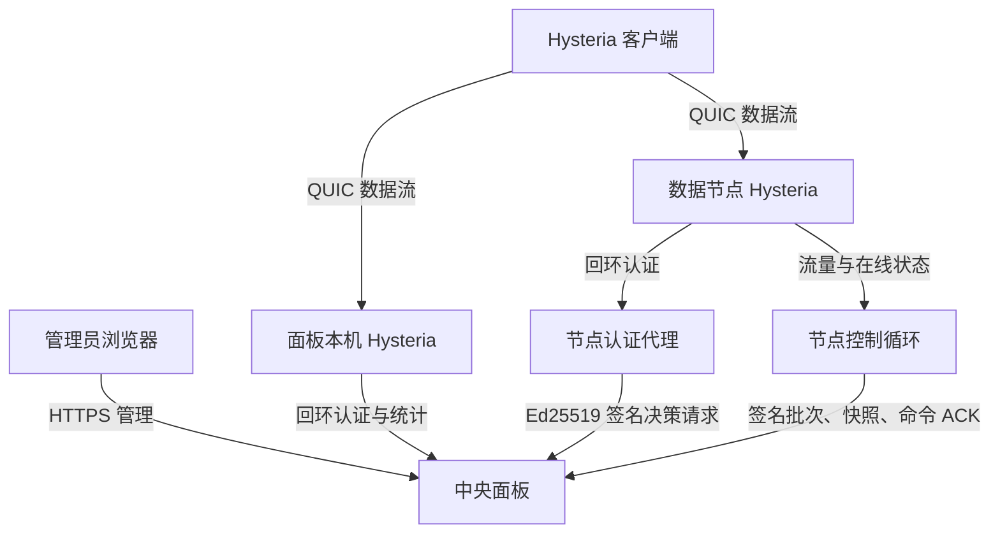

# 架构说明

本文用尽量少的内部术语解释 Hysteria2-panel 的组件、数据流和故障边界。精确请求字段与状态码以[HTTP 接口契约](API.md)为准，关键取舍以[架构决策记录](README.md#架构决策记录adr)为准。

## 设计目标

项目主要解决四个问题：

1. 用标准库 Python 面板管理 Hysteria 多用户，不引入第三方 Python 运行时依赖；
2. 让多台数据节点共用中央用户、设备与流量规则；
3. 让用户数据直达节点，避免中央面板成为带宽中转和单点瓶颈；
4. 让安装、更新、恢复和节点操作可以验证、回滚并在重启后继续。

## 组件关系

| 组件 | 负责什么 | 不负责什么 |
|---|---|---|
| 中央面板 | 管理用户、配额、节点状态、备份、更新与统一决策 | 不转发用户数据，不执行浏览器提供的任意命令 |
| 面板本机 Hysteria | 提供本机数据入口 | 不保存用户规则副本 |
| 数据节点 Hysteria | 提供远端数据入口 | 不直接访问公网中央认证地址 |
| 节点认证代理 | 删除客户端地址后签名转发认证请求 | 不把用户 token 写入临时文件 |
| 节点控制循环 | 提交流量、在线快照，轮询并确认固定命令 | 不接受任意 unit、路径或 shell 参数 |

## 新连接如何认证

1. 客户端向某个 Hysteria 节点发起连接；
2. 节点用认证密钥请求认证；
3. 中央面板同步检查用户是否启用、累计流量、客户端实例数和入口权限；
4. 条件满足时返回用户 ID，否则按 Hysteria 契约返回 HTTP 200 的拒绝结果；
5. Hysteria 根据结果接受或拒绝连接。

面板本机通过回环接口直接认证。数据节点先访问本机认证代理，由代理删除客户端地址并用节点 Ed25519 私钥签名，再发往中央面板。

如果中央状态、在线快照或流量检查点过期，系统对**新认证**采取失败关闭：宁可暂时拒绝，也不在无法核对配额时继续放行。已有数据节点连接不经中央转发，不会因为面板短暂重启被主动切断。

## 在线设备和流量如何汇总

### 在线设备

面板把本机实时值和所有新鲜数据节点快照相加。同一用户在主端口与 UDP `443` 的实例数也会合并。

过期节点快照不会计入当前总数，但会保留最后观察值用于排障，并提示统计暂不完整。设备数是 Hysteria 客户端实例数，不是物理硬件 ID。

### 流量

每个入口分别从 Hysteria 的增量统计接口结算上传和下载。数据节点先把新批次写入权限为 `0600` 的 durable spool 并 `fsync`，再上传中央面板。

中央以 `(nodeId, batchId)` 幂等入账。只有收到提交 ACK 后，节点才删除对应 spool 文件，因此网络中断后的重放不会重复累计。流量同时进入用户总账和机器来源账本。

## 节点如何接入

全新节点对接使用短时、单用途、固定正式版本且经过 Sigstore 验证的命令：

1. 节点生成 Ed25519 身份并向面板登记；
2. 管理员核对双方 16 位指纹短码，服务端仍比较完整 SHA-256 指纹；
3. 节点领取与节点 ID、来源 IP 和签名绑定的短时 grant；
4. 节点部署双 Hysteria 入口、认证代理、控制循环、TCP 探测和网络参数；
5. 中央使用非真实用户的临时保留身份，对主入口和 UDP `443` 做真实 Hysteria 出口验收；
6. 两个入口均通过后才确认安装；
7. 管理员手工加入 DNS，面板只读检查并在状态新鲜时准入。

面板不持有 DNS API 凭据，也不会写入或删除记录。

## 身份与证书

项目中有三类身份，不应混淆：

| 身份 | 用途 | 生命周期 |
|---|---|---|
| 面板 TLS | 管理员访问 HTTPS 面板 | Let’s Encrypt 自动检查和续期 |
| Hysteria TLS | 客户端连接数据入口，URI 固定证书指纹 | 长期保留，只告警，不自动轮换 |
| 节点 Ed25519 | 数据节点对中央请求签名 | 节点本机持有，可安全重绑定 |

用户认证密钥由随机种子和服务器 HMAC key 派生。数据库不保存可直接使用的认证密钥明文，但备份中的数据库与 HMAC 身份组合后可以恢复连接，因此完整备份仍属于高敏感凭据。

## 权限与维护边界

- 浏览器变更都需要管理会话与 CSRF token；
- 登录按来源 IP 限速，同一 IPv6 `/64` 视为一个来源；
- 面板只能通过严格 sudoers 白名单启动固定服务操作；
- 更新、恢复、出站切换和证书续期共享维护锁，避免交叉写入；
- 更新目标、Release 来源、systemd 单元和节点命令都是固定枚举；
- 上传恢复包和 root 恢复任务分别验证，Web 预检不被 root 盲目信任。

## 可用性边界

| 情况 | 预期行为 |
|---|---|
| 中央面板短暂重启 | 数据节点已有连接继续；新认证等待状态恢复 |
| 数据节点与中央断网 | 新流量进入有界 spool；新认证在状态过期后拒绝 |
| 更新或恢复中断 | systemd 根据持久事务标记继续完成或回滚 |
| TCP 探测成功 | 只证明 TCP 端口可连接，不证明 UDP/QUIC 可用 |
| 客户端 `ping` 超时 | Hysteria TUN 不代理 ICMP，不能据此判断代理故障 |
| `FULL` 出站启用 | 允许全部公网目标，不能自动阻止所有滥用 |

## 为什么没有通用第三方管理 API

网页管理使用同源会话与 CSRF。Android App 使用独立的 `/api/v1/mobile/*` 固定路由、短期访问令牌和按设备轮换的刷新令牌；路径解析、动作白名单和 JSON 投影集中在 `hy2panel/mobile_api.py`，但具体写操作仍复用网页端的维护锁、流量结算、状态机与审计边界。

域名流量统计复用面板本机与远程节点已有的流量采集周期。采集端读取回环 Hysteria `/dump/streams`，原始快照只留在进程内存，以连接/流/创建时间为键计算计数器增量；远程节点把有界的用户/域名字节聚合附加到既有持久化、签名和幂等 ACK 批次。中央数据库只保留最近 3 个月、每来源/用户/月流量最高的 500 个规范化域名。该运行时派生表不进入便携备份，也不构成完整访问日志。

项目不提供可自由扩展命令、路径或 root 参数的通用第三方 API，也不开放 CORS。这样既能支持官方移动客户端，又能避免长期万能 token、自动化误操作和任意参数进入特权操作面。
