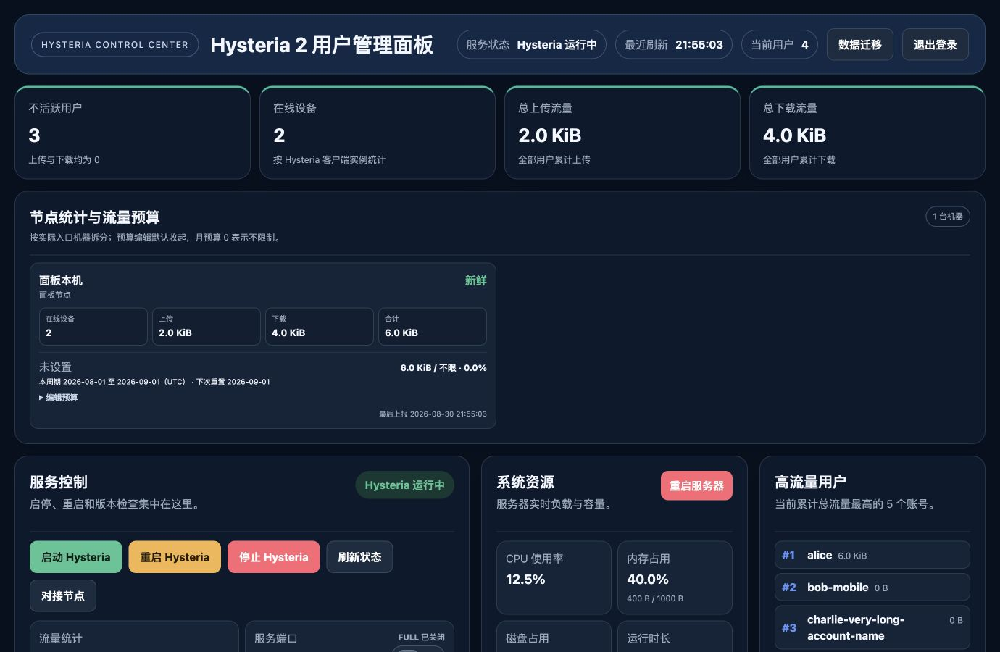
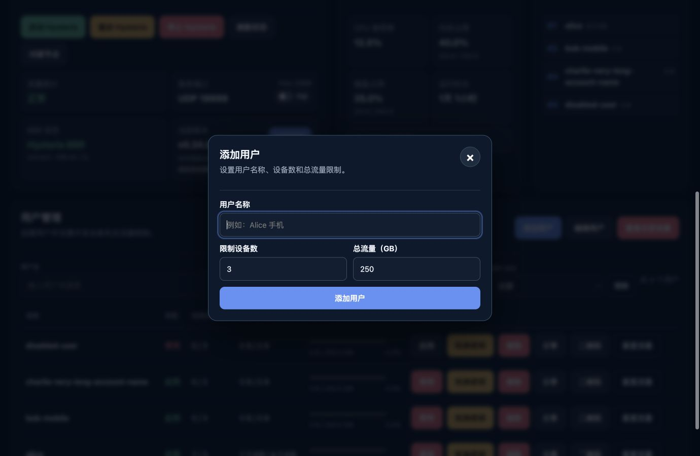
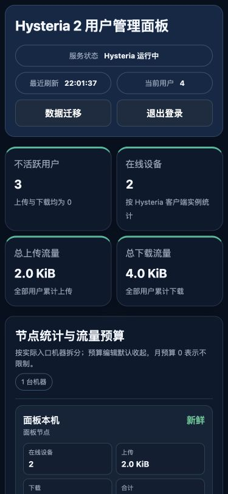
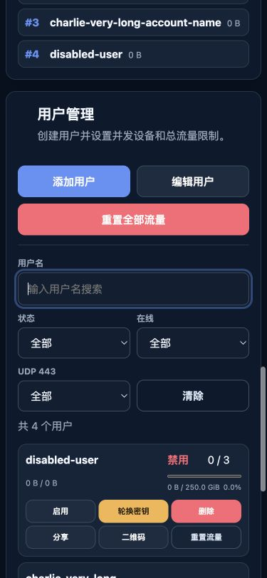

# v0.35.0 稳定化界面审查

## 审查范围

2026-08-30 使用当前工作树、真实 Chromium 内核和测试数据库，审查管理员登录后的桌面仪表盘、添加用户弹窗、375 px 手机首屏与手机用户管理。目标是管理员能看清服务与节点状态，并能只用键盘进入和退出创建用户流程。截图只能证明可见状态；它们不能单独证明完整 WCAG 合规、屏幕阅读器播报或真实触屏体验。

## 步骤与健康度

1. 桌面仪表盘 — 健康。四项总览、节点预算与三张运维卡层级清楚，危险操作颜色明确；1380 px 下无横向溢出。

   

2. 添加用户弹窗 — 健康。标题、说明、字段标签、关闭按钮和主操作均有可访问名称，打开后焦点进入第一个输入框。审查时发现 Esc 关闭不稳定，现已增加统一 Esc 处理，并在关闭后把焦点返回“添加用户”按钮。

   

3. 手机首屏 — 健康。375×812 下 `scrollWidth == viewportWidth`，顶部状态和四个总览卡正确重排，没有横向滚动；长页面的信息密度仍高，但重要运行状态在首屏可见。

   

4. 手机用户管理 — 健康但需持续观察。表格变为卡片，筛选器和六个操作按钮保持可读；可见表单控件均有名称。预算的 `summary` 可点击高度约 17 px，是本轮唯一明确的小目标风险，后续应把触控高度提升到至少 24 px，理想目标 44 px。

   

## 结论与证据边界

当前四个核心步骤没有阻断性 UX 问题，移动端没有横向溢出，标题层级从 h1 到 h2/h3 连续，可见输入控件无缺失标签，按钮无空名称且页面没有重复 ID。已确认键盘打开弹窗时焦点落在用户名输入框，Esc 关闭后焦点回到触发按钮。仍需在发布候选上完成 200% 缩放、VoiceOver/NVDA 和真实手机触控抽查；这些不能由截图或 DOM 静态检查替代。
